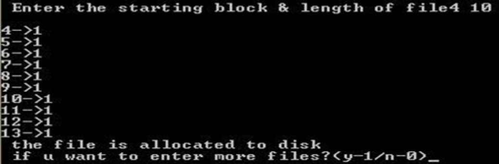
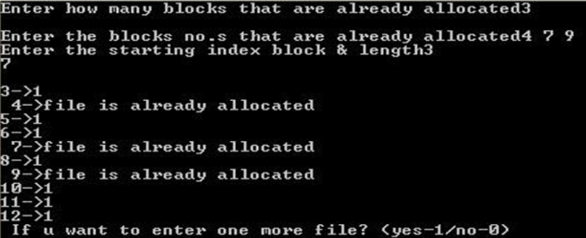
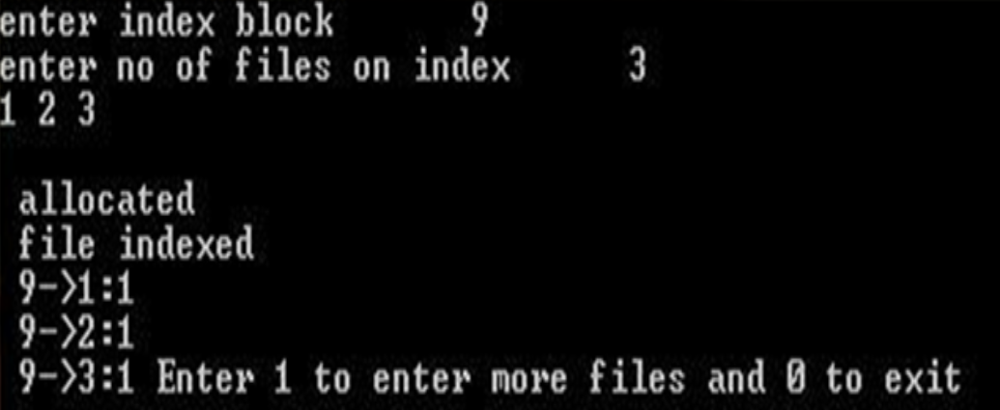

# OS-Programs [](https://awesome.re)
---
## System call
### Program to write some message on the screen.
```c++
#include<stdlib.h>
int main()
{
    write(1, "hello", 5); // 1st parameter is file descriptor (1 is for standard output), 2nd parameter is the message and 3rd parameter is the length of the message
}
```

### Program to read input from the user and print it on the screen.
```c++
#include<stdlib.h>
int main()
{
   int n;
   char buff[50]; 
   n= read(0, buff, 50); // 1st parameter is file descriptor (0 is for standard input), 2nd parameter is the buffer for storing the input and 3rd parameter is the max. possible length of the input. n stores the number of characters read
   write(1, buff, n);
}
```
### Program to create a file and write some content into it by taking the input from the user.
```c++
#include<fcntl.h>
#include<sys/stats.h>
#include<sys/types.h>
int main()
{
    int n, fd;
    char buff[100];
    n=read(0, buff, 100); //taking input from user
    fd=open("file",O_CREAT | O_RDWR, 0777); // creating a new file using open. Open returns file descriptor
    write(fd, buff, n);  //writing into the file
}
```

### Program to copy the contents of one file into a new file
```c++
#include<unistd.h>
#include<stdio.h>
#include<fcntl.h>
#include<sys/types.h>
#include<sys/stat.h>
int main()
{
	int n,m,x;
	char buffer[100];
	n=open("new_file",O_RDONLY);
	m=open("new_file1",O_CREAT|O_WRONLY,0777);

	while((x=read(n,buffer,1))!=0)
	{
	write(m,buffer,x);
	}
	printf("copy completed");
}
```
## Fork system call
### Program that creates child process of a process i.e. process P having child process P1
```c++
#include<sys/types.h>
#include<unistd.h>
#include<stdio.h>
int main()
{
                pid_t  p;
                p=fork(); // creates duplicate process P1
                switch(p)
                {
                                case -1:
                                                printf("Error\n");
                                                break;
                                case 0:  // executed by child
                                                printf(“I am child having id:%d\n”,getpid()); // prints pid of process
                                                printf(“My parent’s id is:%d\n”,getppid());  // prints pid of parent process
                                                break;
                                default:  // executed by parent
                                                printf(“I am parent having id:%d\n”,getpid());
                                                printf(“My child’s id is: %d\n”,p);                                             
                                                break;
                }
}
```

### Program to create a child process. The parent process prints 20-29 and child process prints 0-9. Also both the process prints a common message.
```c++
#include<sys/types.h>
#include<unistd.h>
#include<stdio.h>
int main()
{
                pid_t p;
                int i,j;
                p=fork();
                switch(p)
                {
                                case -1:
                                                printf("Error\n");
                                                break;
                                case 0:
                                                for(i=0;i<10;i++)
                                                {
                                                printf("%d\n",i);
                                                sleep(1);
                                                }
                                                break;
                                default:
                                                wait(); //makes the parent wait for the child to finish
                                                for(j=20;j<30;j++)
                                                {
                                                printf("%d\n",j);
                                                sleep(1);
                                                }
                                                break;
                }
printf("common\n"); // Any statement outside switch is executed by both parent and child
}
```
## Thread concepts
### Program to create a thread. The thread prints numbers from zero to n, where value of n is passed from the main process to the thread. The main process also waits for the thread to finish first and then prints from 20-24. 
```c++
#include <stdio.h>
#include <unistd.h>
#include <stdlib.h>
#include <pthread.h>
#include<string.h>
void *thread_function(void *arg); 
int i,n,j;
int main() {
char *m="5"; 
pthread_t a_thread;  //thread declaration
void *result;
pthread_create(&a_thread, NULL, thread_function, m); //thread is created
pthread_join(a_thread, &result); //process waits for thread to finish . Comment this line to see the difference
printf("Thread joined\n");
for(j=20;j<25;j++)
{
printf("%d\n",j);
sleep(1);
}
printf("thread returned %s\n",result);
}
void *thread_function(void *arg) {    // the work to be done by the thread is defined in this function
int sum=0;
n=atoi(arg);

for(i=0;i<n;i++)
{
printf("%d\n",i);
sleep(1);
}
pthread_exit("Done"); // Thread returns "Done" 
}
```
#### Program 2:

### Program to create a thread. The thread is passed more than one input from the main process. For passing multiple inputs we need to create structure and include all the variables that are to be passed in this structure.
```c++
#include <stdio.h>
#include <pthread.h>
struct arg_struct {   //structure which contains multiple variables that are to passed as input to the thread
    int arg1;
    int arg2;
};
void *arguments(void *arguments)
{
    struct arg_struct *args=arguments;
    printf("%d\n", args -> arg1);
    printf("%d\n", args -> arg2);
    pthread_exit(NULL);    
}

int main()
{
    pthread_t t;
    struct arg_struct args;
    args.arg1 = 5;
    args.arg2 = 7;
    pthread_create(&t, NULL, arguments, &args); //structure passed as 4th argument        
    pthread_join(t, NULL); /* Wait until thread is finished */
}
```
### Program to implement Race Condition:
```c++
#include<pthread.h>
#include<stdio.h>
void *fun1();
void *fun2();
int shared=1; //shared variable
int main()
{
pthread_t thread1, thread2;
pthread_create(&thread1, NULL, fun1, NULL);
pthread_create(&thread2, NULL, fun2, NULL);
pthread_join(thread1, NULL);
pthread_join(thread2,NULL);
printf("Final value of shared is %d\n",shared); //prints the last updated value of shared variable
}

void *fun1()
{
    int x;
    x=shared;//thread one reads value of shared variable
    x++;  //thread one increments its value
    sleep(1);  //thread one is preempted by thread 2
    shared=x; //thread one updates the value of shared variable
}

void *fun2()
{
    int y;
    y=shared;//thread two reads value of shared variable
    y--;  //thread two increments its value
    sleep(3); //thread two is preempted by thread 1
    shared=y; //thread one updates the value of shared variable
}
```
### Process synchronisation with mutex
```c++
#include<pthread.h>
#include<stdio.h>
void *fun1();
void *fun2();
int shared=1; //shared variable
pthread_mutex_t l; //mutex lock
int main()
{
pthread_mutex_init(&l, NULL); //initializing mutex locks
pthread_t thread1, thread2;
pthread_create(&thread1, NULL, fun1, NULL);
pthread_create(&thread2, NULL, fun2, NULL);
pthread_join(thread1, NULL);
pthread_join(thread2,NULL);
printf("Final value of shared is %d\n",shared); //prints the last updated value of shared variable
}

void *fun1()
{
    int x;
    pthread_mutex_lock(&l); //thread one acquires the lock. Now thread 2 will not be able to acquire the
                                            //lock until it is unlocked by thread 1
    x=shared;//thread one reads value of shared variable
    x++;  //thread one increments its value
    sleep(1);  //thread one is preempted by thread 2
    shared=x; //thread one updates the value of shared variable
    pthread_mutex_unlock(&l);
}

void *fun2()
{
    int y;
    pthread_mutex_lock(&l);
    y=shared;
    y--;  
    sleep(1);  
    shared=y; 
    pthread_mutex_unlock(&l);
}

/* the final value of shared variable will be 1. When any one of the threads acquires the lock and is making changes to shared variable the other thread (even if it preempts the running thread) is not able to acquire the lock and thus not able to read the inconsistent value of shared variable. Thus only one of the thread is running in its critical section at any given time */
```
## Process synchronisation with semaphores
### Program for process synchronization using semaphores
#### Program create two threads: one to increment the value of a shared variable and second to decrement the value of shared variable. Both the threads make use of semaphore variable so that only one of the threads is executing in its critical section
```c++
#include<pthread.h>
#include<stdio.h>
#include<semaphore.h>
void *fun1();
void *fun2();
int shared=1; //shared variable
sem_t s; //semaphore variable
int main()
{
sem_init(&s,0,1); //initialize semaphore variable - 1st argument is address of variable, 2nd is number of processes sharing semaphore, 3rd argument is the initial value of semaphore variable

pthread_t thread1, thread2;
pthread_create(&thread1, NULL, fun1, NULL);
pthread_create(&thread2, NULL, fun2, NULL);
pthread_join(thread1, NULL);
pthread_join(thread2,NULL);
printf("Final value of shared is %d\n",shared); //prints the last updated value of shared variable
}

void *fun1()
{
    int x;
    sem_wait(&s); //executes wait operation on s
    x=shared;//thread one reads value of shared variable
    x++;  //thread one increments its value
    sleep(1);  //thread one is preempted by thread 2
    shared=x; //thread one updates the value of shared variable
    sem_post(&s); //executes signal operation on s
}

void *fun2()
{
    int y;
    sem_wait(&s);
    y=shared;
    y--;  
    sleep(1);  
    shared=y; 
    sem_post(&s);
}

/* the final value of shared variable will be 1. When any one of the threads execute the wait operation the value of "s" becomes zero and hence the other thread (even if it preempts the running thread) is not able to successfully execute the wait operation on "s" thus not able to read the inconsistent value of shared variable. Thus only one of the thread is running in its critical section at any given time */
```
## File allocation methods
### Simulate all File allocation strategies:
**a. Sequential**
**b. Indexed**
**c. Linked**

### Theory

a) **Sequential file allocation strategy:** In this type of strategy, the files are allocated in a sequential manner such that there is a continuity among the various parts or fragments of the file.

b) **Indexed file allocation strategy:** In this type of strategy, the files are allocated based on the indexes that are created for each fragment of the file such that each and every similar indexed file is maintained by the primary index thereby providing flow to the file fragments.

c) **Linked file allocation strategy:** In this type of strategy, the files are allocated in a linked list format where each and every fragment is linked to the other file through either addresses or pointers. Thus, the starting location of the file serve the purpose of extraction of the entire file because every fragment is linked to each other.

### a) Implementation of Sequential File Allocation:
```c++
#include<stdio.h>
#include<stdlib.h>
main()
{
int f[50],i,st,j,len,c;
//clrscr();
for(i=0;i<50;i++)
f[i]=0;
X:
printf("\n Enter the starting block & length of file");
scanf("%d%d",&st,&len);
for(j=st;j<(st+len);j++)
if(f[j]==0)
{
f[j]=1;
printf("\n%d->%d",j,f[j]);
}
else
{
printf("Block already allocated");
break;
}
if(j==(st+len))
printf("\n the file is allocated to disk");
printf("\n if u want to enter more files?(y-1/n-0)");
scanf("%d",&c);
if(c==1)
goto X;
else
exit(0);
  }
 ```
##### Output:

### b) Implementation of  Linked File Allocation:
```c++
#include<stdio.h>
#include<stdlib.h>
main()
{
int f[50],p,i,j,a,st,len,n,c;
//clrscr();
for(i=0;i<50;i++)
f[i]=0;
printf("Enter how many blocks that are already allocated");
scanf("%d",&p);
printf("\nEnter the blocks no.s that are already allocated");
for(i=0;i<p;i++)
{
scanf("%d",&a);
f[a]=1;
}
X:
printf("Enter the starting index block & length");
scanf("%d%d",&st,&len);
for(j=st;j<(len+st);j++)
{
if(f[j]==0)
{
f[j]=1;
printf("\n%d->%d",j,f[j]);
}
else
{
printf("\n %d->file is already allocated",j);
len++;
}
}
printf("\n If u want to enter one more file? (yes-1/no-0)");
scanf("%d",&c);
if(c==1)
goto X;
else
exit(0);
}
```

##### Output:

### c) Implementation of  Indexed File Allocation:
```c++
#include<stdio.h>
#include<stdlib.h>
int f[50],i,k,j,inde[50],n,c,count=0,p;
main()
{
//clrscr();
for(i=0;i<50;i++)
f[i]=0;
x:
printf("enter index block\t");
scanf("%d",&p);
if(f[p]==0)
{
f[p]=1;
printf("enter no of files on index\t");
scanf("%d",&n);
}
else
{
printf("Block already allocated\n");
goto x;
}
for(i=0;i<n;i++)
scanf("%d",&inde[i]);
for(i=0;i<n;i++)
if(f[inde[i]]==1)
{
printf("Block already allocated");
goto x;
}
for(j=0;j<n;j++)
f[inde[j]]=1;
printf("\n allocated");
printf("\n file indexed");
for(k=0;k<n;k++)
printf("\n %d->%d:%d",p,inde[k],f[inde[k]]);
printf(" Enter 1 to enter more files and 0 to exit\t");
scanf("%d",&c);
if(c==1)
goto x;
else
exit(0);
//getch();
}
```
##### Output:

## Inter Process Communication
### 1) Anonymous Pipes
#### Program to send a message from parent process to child process.
```c++
#include<stdio.h>
#include<stdlib.h>
#include<unistd.h>
int main()
{
      int fd[2],n;
      char buffer[100];
      pid_t p;
      pipe(fd);
      p=fork();
      if(p>0)  //parent
      {
                  close(fd[0]);
                  printf("Passing value to child\n");
                  write(fd[1],"hello\n",6);
                  wait();
                 
      }
      else // child
      {
                  close(fd[1]);                
                  n=read(fd[0],buffer,100);
                  write(1,buffer,n);
      }
}
```
### Program For IPC using popen and pclose
#### Program to write into a pipe
```c++
#include<stdio.h> 
#include<stdlib.h> 
#include<unistd.h> 
#include<string.h> 
int main() 
{
       FILE *rd;
       char buffer[50];
       sprintf(buffer,"name first");
       rd=popen("wc -c","w"); // wc -c -> is the process which counts the number of                                        characters passed, 2nd parameter is "w" which means pipe is opened in writing mode
       fwrite(buffer,sizeof(char),strlen(buffer),rd); // to write the data into the pipe
      pclose(rd);
}
```
#### Program to read from a pipe
```c++
#include<stdio.h> 
#include<stdlib.h> 
#include<unistd.h> 
#include<string.h> 
int main() 
{
       FILE *rd;
       char buffer[50];
       rd=popen("ls","r");
       fread(buffer, 1, 50, rd);
       printf("%s\n", buffer);
      pclose(rd);
}
```
### 2) Named Pipes: 
#### This will require three different programs to work
#### Program 1: Creating fifo/named pipe ( 1.c )
```c++
            #include<unistd.h>
            #include<stdlib.h>
            #include<stdio.h>
            int main()
            {
                        int res;
                        res = mkfifo("fifo1",0777); //creates a named pipe with the name fifo1
                        printf("named pipe created\n");
            }
```
> Now compile and run this program.

#### Program 2: Writing to a fifo/named pipe ( 2.c )
```c++
            #include<stdlib.h>
            #include<stdio.h>
            #include<fcntl.h>
            int main()
            {
                        int res,n;
                        res=open("fifo1",O_WRONLY);
                       write(res,"written",7);
                        printf("Process %d finished\n",getpid());
            }
```
>Compile this program as    *gcc -o 2 2.c*
> Note: If you run this you will not see any output

#### Program 3: Reading from the named pipe ( 3.c )
```c++
            #include<stdlib.h>
            #include<stdio.h>
            #include<fcntl.h>
            int main()
            {
                        int res,n;
                        char buffer[100];
                        res=open("fifo1",O_RDONLY);
                        n=read(res,buffer,100);
                        printf("Total bytes read: %d\n",n);
                        printf("%s was passed to me \n",buffer);
                        printf("Process %d finished\n",getpid());
                      
            }
```
>Compile the program as   gcc  -o  3  3.c
>Now run both the object files simultaneously as    ./2  &  ./3
### 3) Shared Pipes
#### Program 1: This program creates a shared memory segment, attaches itself to it and then writes some content into the shared memory segment.
```c++
#include<unistd.h>
#include<stdlib.h>
#include<stdio.h>
#include<string.h>
#include<sys/shm.h>
int main()
{
    int i;
    void *shared_memory;
    char buff[100];
    int shmid;
    shmid=shmget((key_t)2345, 1000,0666|IPC_CREAT); //creates shared memory segment
    printf("Key of shared memory is %d\n",shmid);
    shared_memory=shmat(shmid,NULL,0); //process attached to shared memory segment
    printf("Process attached at %X\n",(int)shared_memory);
    printf("Enter some data to write to shared memory\n");
    read(0,buff,100); \\get some input from user
    strcpy(shared_memory,buff); \\data written to shared memory
    printf("You wrote : %s\n",shared_memory);
}
```

#### Program 2: This program attaches itself to the shared memory segment created in Program 1 and then reads whatever was written in the shared memory via Program 1
```c++
#include<unistd.h>
#include<stdlib.h>
#include<stdio.h>
#include<string.h>
#include<sys/shm.h>
int main()
{
    int i;
    void *shared_memory;
    char buff[100];
    int shmid;
    shmid=shmget((key_t)2345, 1000,0666);
    printf("Key of shared memory is %d\n",shmid);
    shared_memory=shmat(shmid,NULL,0); //process attached to shared memory segment
    printf("Process attached at %X\n",(int)shared_memory);
    printf("Data read from shared memory is : %s\n",shared_memory);
}
```
